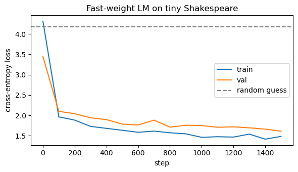
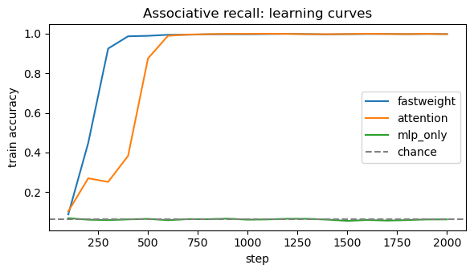
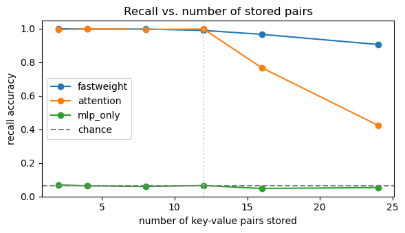

# Fast-Weight Memory: a small language model with test-time learning

A from-scratch PyTorch implementation of a sequence model whose mixing layer is a **fast-weight memory** (delta rule) instead of self-attention. Each layer keeps a small matrix that it rewrites with a gradient-style update on every token it reads, so the model keeps a **fixed-size memory** rather than a growing KV cache.

Everything lives in one notebook, [`fast_weight_lm.ipynb`](fast_weight_lm.ipynb), and runs on a laptop CPU.

## Summary of results

| Experiment | Result |
|---|---|
| Character-level language model (tiny Shakespeare, 0.62M params, 1500 steps) | Loss fell from 4.3 to about 1.5 train / 1.6 val; samples have real words and play-script structure |
| Memory footprint | 15,744 floats of state, constant at any context length (a same-size transformer's KV cache is 76.8M floats at 100K tokens) |
| Associative recall (train on 2–12 pairs) | Fast-weight model learns it fully; stays at 91% accuracy at 24 pairs, where the attention baseline drops to 42% |
| Sanity check | An MLP-only model (cannot see earlier tokens) stays at chance, as it should |

These are small-scale, single-seed results on a toy task. See [Limitations](#limitations) before drawing conclusions.

## The idea

Standard attention compares every token with every earlier token and stores all of them. A fast-weight layer instead compresses the past into a matrix `W`, and **learns while it reads**. For each token it forms a key `k`, value `v` and query `q`, then takes one gradient step on the loss `½‖Wk − v‖²`:

```
W_t = W_{t-1} + β_t · (v_t − W_{t-1} k_t) · k_tᵀ      (write: the delta rule)
o_t = W_t q_t                                          (read)
```

`β_t` is a per-token, per-head learning rate predicted by the network, so the model decides how strongly to write each token into memory. There are two levels of learning:

- **Outer loop:** ordinary backpropagation trains the projections that produce `q`, `k`, `v` and `β`.
- **Inner loop:** the update above adjusts `W` itself at inference time, with no backprop.

This is the same family as DeltaNet and test-time-training layers.

## Model details

- **`FastWeightMemory`**: drop-in replacement for self-attention. Queries, keys and values pass through a short causal depthwise convolution (so a position can see its few previous tokens, which lets the memory bind a key token to the value that follows it), then queries and keys are L2-normalised for stable updates.
- **Block:** pre-LayerNorm, fast-weight layer, residual, then a GELU MLP with residual.
- **State:** `(W, conv_buffer)` per layer. Its size depends only on the model width, never on the number of tokens processed, which is what makes generation constant-memory.
- **Baselines** (used in the recall experiment): standard causal self-attention with learned positional embeddings, and an MLP-only model with no mixing across positions.

The language model uses 3 layers, `d_model=128`, 4 heads (each head's memory is a 32×32 matrix).

## Results

### 1. Language modelling (tiny Shakespeare)



Trained for 1500 steps (batch 32, sequence length 64) on CPU. Final loss was about 1.48 train and 1.61 val, against about 4.2 for random guessing over the 65-character vocabulary. Validation loss is measured on a single batch per checkpoint, so it is noisy.

A sample (prompted with `ROMEO:`):

```
ROMEO:
You have not lexs, I do not know a hooo.

LUCIO:
If it for love, whose for lions,
The blockedy of the company, and that not your prince.
```

The model has learned speaker names, line structure, and many real words and short phrases, but not coherent sentences. That is expected for a 0.62M-parameter model trained this briefly.

### 2. Constant-memory generation

| Context length | Fast-weight state | Transformer KV cache (same width and depth) |
|---:|---:|---:|
| 1,000 tokens | 15,744 floats | 768,000 floats |
| 10,000 tokens | 15,744 floats | 7,680,000 floats |
| 100,000 tokens | 15,744 floats | 76,800,000 floats |

The KV cache column is computed as `2 × layers × d_model × tokens` for a hypothetical transformer of the same size. It illustrates the scaling, not a measured comparison.

### 3. Associative recall

The model sees key→value pairs, then a query key, and must output the matching value:

```
k7 v3  k2 v9  k15 v1  ...  <QUERY> k2   →   v9
```

There are 32 possible keys and 16 possible values, so **chance is 6.25%**. Training uses 2 to 12 pairs per sequence. Evaluation goes up to 24 pairs, including lengths never seen in training. All models have 2 layers and `d_model=64`, trained for 2000 steps.



Both the fast-weight and attention models solve the task. The fast-weight model got there a little sooner in this run (92% by step 300, 99% by step 400, versus 88% by step 500 and 99% by step 600 for attention). The MLP-only model never rises above chance.

**Accuracy by number of stored pairs** (512 test sequences each; 2–12 pairs is the training range):

| Pairs | 2 | 4 | 8 | 12 | 16 | 24 |
|---|---:|---:|---:|---:|---:|---:|
| Fast-weight | 1.00 | 1.00 | 1.00 | 0.99 | 0.97 | 0.91 |
| Attention | 0.99 | 1.00 | 1.00 | 1.00 | 0.77 | 0.42 |
| MLP-only | 0.07 | 0.06 | 0.06 | 0.06 | 0.05 | 0.05 |



Within the training range, fast-weight and attention models are equally accurate. Beyond it, attention degrades sharply while the fast-weight model degrades gently. A likely explanation is that the attention baseline uses learned absolute positional embeddings, and positions beyond those seen in training were never trained. The fast-weight model has no positional table, so longer sequences are not out-of-distribution in the same way. I have not tested this explanation, for example by swapping in rotary or relative positions for the baseline.

## Running it

```bash
python3 -m venv .venv
source .venv/bin/activate          # Windows: .venv\Scripts\activate
pip install torch numpy matplotlib jupyter
jupyter notebook fast_weight_lm.ipynb
```

Run all cells top to bottom. The notebook downloads tiny Shakespeare (about 1 MB) to `input.txt` on first run. If you hit `CERTIFICATE_VERIFY_FAILED` (common with python.org installs on macOS), the notebook tries the `certifi` bundle automatically; failing that, run `curl -o input.txt https://raw.githubusercontent.com/karpathy/char-rnn/master/data/tinyshakespeare/input.txt` and re-run the cell.

Results above were produced on CPU with PyTorch 2.10. The two settings you are most likely to change are `LM_STEPS` (language model training length) and `RECALL_STEPS` (recall experiment length). Training is slowed by the sequential per-token loop; a GPU helps little for models this small.

## Limitations

- **Toy scale.** The model has 0.62M parameters and trains on 1 MB of text. These results do not say how the approach compares with transformers at realistic scale.
- **Single seed.** Every number comes from one run. Differences like "converges about 200 steps sooner" could change with a different seed.
- **Synthetic task.** Associative recall is a clean test of whether the memory stores and retrieves, but it is a narrow capability, and attention is known to do it well. The baseline here is a basic one.
- **The 24-pair drop is unexplained.** The fast-weight model loses a few points at 24 pairs. This could be memory capacity (each head's memory is 32×32) or length generalisation; the experiment does not separate them.
- **Slow implementation.** The time loop is plain Python. Production implementations use chunkwise-parallel algorithms and custom kernels.
- **No forgetting.** Memory is only ever overwritten by new writes, never decayed, which limits how long it stays useful on long inputs.

## Ideas for extending it

1. Add a decay on `W` (forgetting), as in Gated DeltaNet.
2. Use momentum or a surprise-based update, as in Titans.
3. Write a chunkwise-parallel version of the layer for faster training.
4. Separate capacity from length generalisation: vary head size, and give the attention baseline rotary positions.
5. Try a hybrid model that mixes a few attention layers with fast-weight layers.
6. Repeat the experiments over several seeds and report mean and spread.

## Related work

This project is a small educational implementation of ideas from the literature, not a reproduction of any one paper. Good starting points:

- Vaswani et al., *Attention Is All You Need* (2017)
- Schmidhuber, *Learning to Control Fast-Weight Memories* (1992)
- Schlag, Irie and Schmidhuber, *Linear Transformers Are Secretly Fast Weight Programmers* (2021)
- Yang et al., *Parallelizing Linear Transformers with the Delta Rule over Sequence Length* (2024)
- Sun et al., *Learning to (Learn at Test Time): RNNs with Expressive Hidden States* (2024)
- Behrouz, Zhong and Mirrokni, *Titans: Learning to Memorize at Test Time* (2024)
